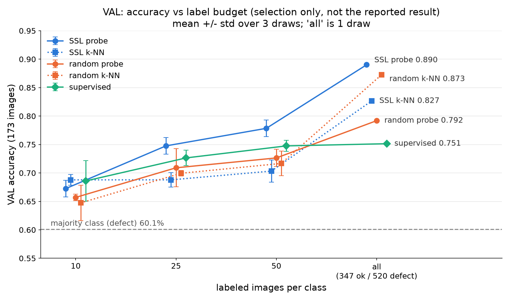

# VAL selection results (selection only, not the reported result)

These are VALIDATION numbers. Val (173 images: 69 ok, 104 defect) chose k, C, the anomaly k,
the threshold, and the supervised best epoch, so every number here is optimistic.
The reported result is the single test run in eval.py.

Majority class (always 'defect') on val: 60.1%. One val image = 0.58 points.

## VAL accuracy by labels per class (mean +/- std over 3 draws; 'all' = 1 draw)

| method | 10 | 25 | 50 | all |
|---|---|---|---|---|
| SSL probe | 0.672 +/- 0.014 | 0.748 +/- 0.014 | 0.778 +/- 0.014 | 0.890 |
| SSL k-NN | 0.688 +/- 0.009 | 0.688 +/- 0.012 | 0.703 +/- 0.020 | 0.827 |
| random probe | 0.657 +/- 0.005 | 0.709 +/- 0.033 | 0.726 +/- 0.015 | 0.792 |
| random k-NN | 0.647 +/- 0.031 | 0.699 +/- 0.005 | 0.717 +/- 0.022 | 0.873 |
| supervised | 0.686 +/- 0.036 | 0.726 +/- 0.014 | 0.748 +/- 0.010 | 0.751 |

## Flags (VAL)

- SSL, budget 10: k-NN beats probe by 1.5 points
- random, budget all: k-NN beats probe by 8.1 points

Budgets where the probe beats k-NN by > 10 points on VAL: 0. Budgets where k-NN beats the probe on VAL: 2.

