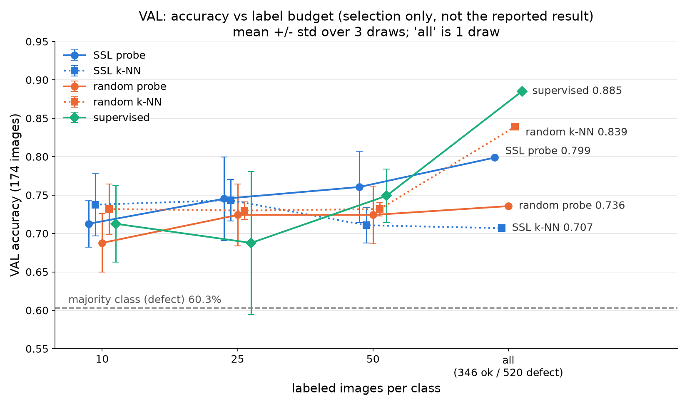

# VAL selection results (selection only, not the reported result)

These are VALIDATION numbers. Val (174 images: 69 ok, 105 defect) chose k, C, the anomaly k,
the threshold, and the supervised best epoch, so every number here is optimistic.
The reported result is the single test run in eval.py.

Majority class (always 'defect') on val: 60.3%. One val image = 0.57 points.

## VAL accuracy by labels per class (mean +/- std over 3 draws; 'all' = 1 draw)

| method | 10 | 25 | 50 | all |
|---|---|---|---|---|
| SSL probe | 0.713 +/- 0.030 | 0.745 +/- 0.054 | 0.761 +/- 0.046 | 0.799 |
| SSL k-NN | 0.738 +/- 0.041 | 0.743 +/- 0.027 | 0.711 +/- 0.023 | 0.707 |
| random probe | 0.688 +/- 0.038 | 0.724 +/- 0.040 | 0.724 +/- 0.038 | 0.736 |
| random k-NN | 0.732 +/- 0.033 | 0.730 +/- 0.011 | 0.732 +/- 0.009 | 0.839 |
| supervised | 0.713 +/- 0.050 | 0.688 +/- 0.093 | 0.749 +/- 0.035 | 0.885 |

## Flags (VAL)

- SSL, budget 10: k-NN beats probe by 2.5 points
- random, budget 10: k-NN beats probe by 4.4 points
- random, budget 25: k-NN beats probe by 0.6 points
- random, budget 50: k-NN beats probe by 0.8 points
- random, budget all: k-NN beats probe by 10.3 points

Budgets where the probe beats k-NN by > 10 points on VAL: 0. Budgets where k-NN beats the probe on VAL: 5.

## Anomaly score (VAL)

Score = cosine distance of a val image to the labeled ok embeddings of the budget; the option (local k, all_ok, centroid) and the threshold (catch 95% of val defects) are chosen on val.

| encoder | budget | AUROC | false rejects at 95% defect recall | chosen option per draw |
|---|---|---|---|---|
| ssl | 10 | 0.792 +/- 0.010 | 0.705 +/- 0.065 | 10/10/10 |
| ssl | 25 | 0.803 +/- 0.012 | 0.691 +/- 0.008 | all_ok/all_ok/all_ok |
| ssl | 50 | 0.794 +/- 0.014 | 0.705 +/- 0.017 | all_ok/all_ok/all_ok |
| ssl | all | 0.787 | 0.739 | all_ok |
| random | 10 | 0.596 +/- 0.048 | 0.894 +/- 0.042 | centroid/10/5 |
| random | 25 | 0.607 +/- 0.030 | 0.899 +/- 0.014 | all_ok/all_ok/20 |
| random | 50 | 0.604 +/- 0.017 | 0.879 +/- 0.017 | all_ok/all_ok/all_ok |
| random | all | 0.717 | 0.449 | 1 |

### Grid change after seeing val

Anomaly grid widened AFTER seeing val: added 'all_ok' (mean cosine distance to all labeled ok embeddings) and 'centroid' (cosine distance to the labeled ok centroid). Reason, as observed on the pre_logo run: with the 'all' budget (346 ok refs), k in {1, 5, 10, 20} only measures local distance; every val image, ok or defect, has a near ok neighbor (median nearest-ok distance ratio defect/ok = 1.01), so SSL val AUROC fell to 0.57 while a global distance gave about 0.79. At 10 per class the chosen k = 10 already averaged over every ok ref, i.e. it was already a global score. Because the grid change was made after looking at val, val AUROC for the anomaly score is extra optimistic; the test run is the check.
